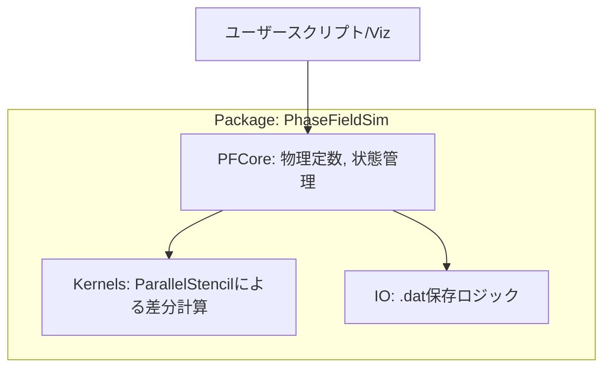

# Design Document: pfm-julia-core

## Overview
pfm1のC++コードをJuliaに移植し、`ParallelStencil.jl` を用いた高性能なシミュレーションエンジンを提供します。

### Goals
- C++版（三相分離フェーズフィールド法）の物理挙動を忠実に再現する。
- CPUマルチスレッドおよび将来的なGPU実行に対応した計算エンジンを構築する。
- 任意の格子サイズ（nx, ny）に対応し、連番ファイルでのデータ保存を可能にする。

### Non-Goals
- 可視化UIの実装（pfm-julia-vizの役割）。
- 分散並列計算（MPI）。

## Boundary Commitments

### This Spec Owns
- `ParallelStencil` を用いた計算カーネル（Cahn-Hilliard方程式の解法）。
- シミュレーションの状態管理（濃度場、物理パラメータ、時間発展）。
- 計算結果（.dat形式）のファイル入出力ロジック。
- パッケージの基本構造（Project.toml）とユニットテスト。

### Out of Boundary
- Makieによるプロット、アニメーション生成。
- ユーザーインターフェース（CLI引数解析以外のGUI等）。

### Allowed Dependencies
- `ParallelStencil.jl`: 計算エンジンのコア。
- `Printf.jl`: ファイル名のフォーマット。
- `StaticArrays.jl` (optional): 小さなパラメータ保持用。

### Revalidation Triggers
- 計算カーネルの引数（シグネチャ）の変更。
- 出力ファイル（.dat）のフォーマット変更。

## Architecture

### Architecture Pattern & Boundary Map


### Technology Stack

| Layer | Choice / Version | Role in Feature | Notes |
|-------|------------------|-----------------|-------|
| Language | Julia 1.10+ | メイン言語 | 高性能な数値計算 |
| Solver | ParallelStencil.jl | stencil計算の抽象化 | CPU/GPUポータビリティ |
| Parallelism | Threads / (将来のGPU) | 並列実行 | 高速化 |
| Output | Plain Text (.dat) | データ保存 | C++版との互換性 |

## File Structure Plan

### Directory Structure
```
PhaseFieldSim/
├── Project.toml           # パッケージ定義
├── src/
│   ├── PhaseFieldSim.jl   # メインモジュール・エントリポイント
│   ├── Kernels.jl         # ParallelStencilマクロによる計算カーネル
│   ├── Simulation.jl      # シミュレーション管理構造体と制御ロジック
│   └── IO.jl              # データ保存
└── test/
    └── runtests.jl        # ユニットテスト
```

## Requirements Traceability

| Requirement | Summary | Components | Interfaces |
|-------------|---------|------------|------------|
| 1.1 | パッケージ構成 | Project.toml | - |
| 2.1 | 任意格子サイズ | Simulation.jl | `Simulation(nx, ny, ...)` |
| 2.3 | 周期境界条件 | Kernels.jl | `@parallel_indices` でのインデックス処理 |
| 2.4 | 質量保存補正 | Simulation.jl / Kernels.jl | 補正用カーネル |
| 2.6 | 物理定数再現 | Simulation.jl | デフォルト値設定 |
| 3.1 | ParallelStencil使用 | Kernels.jl | Stencil定義 |
| 4.2 | 連番ファイル保存 | IO.jl | `save_snapshot(sim, step)` |

## Components and Interfaces

### [Core / Simulation]

#### [PFSimulation]

| Field | Detail |
|-------|--------|
| Intent | シミュレーションの状態とパラメータを一括管理する |
| Requirements | 1.2, 2.1, 2.6 |

**Responsibilities & Constraints**
- 濃度場（c2, c3）および中間バッファの保持。
- 物理定数（Ω, T, κ, M）の保持。
- ステップ実行の制御。

**Contracts**: Service [X] / State [X]

##### Service Interface
```julia
struct Simulation{T, A}
    nx::Int
    ny::Int
    c2::A
    c3::A
    # ... 他のバッファとパラメータ
end

function step!(sim::Simulation)
    # 1ステップの計算実行
end
```

### [Kernels]

#### [DiffusionKernels]

| Field | Detail |
|-------|--------|
| Intent | ParallelStencilを用いた差分計算カーネル群 |
| Requirements | 2.3, 2.4, 3.1, 3.3 |

**Responsibilities & Constraints**
- ラプラシアン計算および化学ポテンシャルの計算。
- 周期境界条件の適用（ParallelStencilのインデックス処理による）。
- 質量保存のための補正項適用。

**Contracts**: Service [X]

## Testing Strategy

- **Unit Tests**: 
    - 初期化時のノイズ振幅が ±0.01 の範囲内であることの確認 (Req 2.1)。
    - 1ステップ実行後の平均濃度が初期値から変化していないこと（質量保存の検証、Req 2.4）。
    - 濃度がクランプ範囲内 [1e-6, 1-1e-6] に収まっていること (Req 2.5)。
- **Integration Tests**:
    - 指定ステップごとに正しくファイルが生成されること (Req 4.1)。
    - 生成されたファイルの内容がC++版のフォーマットと一致すること (Req 4.3)。
