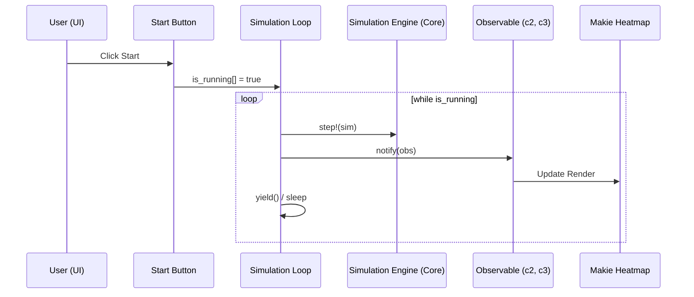

# Design Document: pfm-julia-viz

## Overview
`pfm-julia-core` のシミュレーション結果を、GLMakie を用いてリアルタイム・対話的に可視化するための設計です。

### Goals
- 濃度場（c2, c3）のリアルタイム・ヒートマップ表示を実現する。
- UI（ボタン・スライダー）によるシミュレーションの実行制御とパラメータ調整を可能にする。
- シミュレーション過程を動画ファイルとしてエクスポートする。
- パッケージの軽量性を保つため、`Package Extensions` 構成を採用する。

### Non-Goals
- 3次元可視化。
- ブラウザベースのダッシュボード（HTTPサーバー）構築。

## Boundary Commitments

### This Spec Owns
- Makie を用いた UI レイアウト定義。
- シミュレーションループと描画の同期（Observable の管理）。
- 動画保存（`record`）の制御ロジック。
- `PhaseFieldSim` からの可視化エントリポイント（`visualize` 関数）。

### Out of Boundary
- 物理計算カーネルの実装（`pfm-julia-core` が担当）。
- ファイル保存（`.dat`）の低レベルロジック。

### Allowed Dependencies
- `GLMakie.jl`: メインの可視化ライブラリ。
- `PhaseFieldSim.jl`: シミュレーションエンジン（計算対象）。
- `Observables.jl`: 状態管理。

### Revalidation Triggers
- `Simulation` 構造体のフィールド名やデータ型の変更。
- Makie のメジャーアップデートによる API 破壊的変更。

## Architecture

### Architecture Pattern & Boundary Map
```mermaid
graph TB
    subgraph PhaseFieldSim (Core)
        Sim[Simulation Struct]
        Step[step! Function]
    end
    subgraph Extension: PhaseFieldSimMakieExt
        Viz[visualize Function]
        Obs[Observables: c2, c3, is_running]
        UI[UI Widgets: Sliders, Buttons]
        Loop[Simulation Loop Task]
        Viz --> UI
        Viz --> Obs
        Loop --> Step
        Loop --> Sim
        UI --> Sim
        Loop -.-> Obs
        Obs -.-> UI
    end
```

### Technology Stack

| Layer | Choice / Version | Role in Feature | Notes |
|-------|------------------|-----------------|-------|
| Visualization | GLMakie.jl | リアルタイム描画 | GPU加速を利用 |
| Reactivity | Observables.jl | データと描画の同期 | Makie標準 |
| Integration | Package Extension | プラグイン構成 | Julia 1.9+ |
| Video | FFMPEG (via Makie) | アニメーション保存 | |

## File Structure Plan

### Directory Structure
```
PhaseFieldSim/
├── src/
│   └── PhaseFieldSim.jl   # visualize(sim) のスタブ定義を追加
├── ext/
│   └── PhaseFieldSimMakieExt.jl # 可視化機能のメイン実装
└── test/
    └── test_viz.jl        # 可視化機能のスモークテスト（要手動確認）
```

### Modified Files
- `PhaseFieldSim/Project.toml` — `[weakdeps]` と `[extensions]` の追加。
- `PhaseFieldSim/src/PhaseFieldSim.jl` — `visualize` 関数のスタブ追加。

## System Flows

### 実行制御フロー


## Requirements Traceability

| Requirement | Summary | Components | Interfaces |
|-------------|---------|------------|------------|
| 1.1 | リアルタイム表示 | PhaseFieldSimMakieExt.jl | `heatmap!(ax, obs_c2)` |
| 2.1 | Start/Stop制御 | PhaseFieldSimMakieExt.jl | `Button`, `while is_running` |
| 3.1 | パラメータ調整 | PhaseFieldSimMakieExt.jl | `SliderGrid` |
| 4.1 | アニメーション保存 | PhaseFieldSimMakieExt.jl | `record(fig, filename)` |
| 5.1 | Package Extension | Project.toml / ext/ | Extension 定義 |

## Components and Interfaces

### [Visualization / UI]

#### [Heatmap Dashboard]

| Field | Detail |
|-------|--------|
| Intent | シミュレーションの状態を可視化し、制御するための統合画面を提供する |
| Requirements | 1.1, 1.2, 2.1, 3.1 |

**Responsibilities & Constraints**
- `c2`, `c3` の二画面表示、あるいは RGB 合成表示。
- シミュレーションパラメータ（Ω, 移動度）との双方向同期。
- 実行状態（Running/Paused）の管理。

**Contracts**: State [X] / Batch [ ]

##### Service Interface (Stub)
```julia
function visualize(sim::Simulation)
    # Stub in PhaseFieldSim.jl
    error("GLMakie を `using` してください。")
end
```

## Testing Strategy

- **Manual Verification**:
    - `visualize(sim)` を実行し、ウィンドウが表示されること。
    - Start ボタンで計算が始まり、Heatmap が動的に変化すること。
    - スライダーを動かし、パターン形成の速度や形状が変化することを確認。
- **Automated Smoke Test**:
    - Extension が正しくロードされるかを確認するテスト (`Base.get_extension`)。
    - 動画保存関数がエラーなく終了し、ファイルが生成されることを確認。
